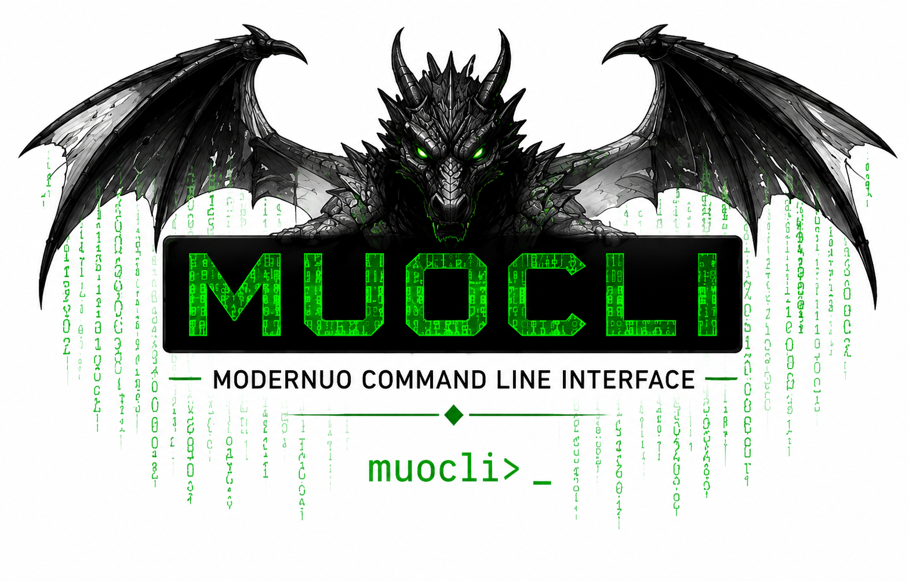

```markdown
<p align="center">
  
</p>

# MUOCLI
### ModernUO Command Line Interface

MUOCLI is a standalone command-line client for administering **ModernUO** shards without logging into the game.

It communicates with the MUOCLI plugin running on the shard, providing a simple, secure interface for remote administration and automation.

---

## Features

### Account Management

- Create player accounts
- Delete accounts
- Change passwords
- Set account access level
- List all accounts
- Display account information

### Server Administration

- Ping the server
- View server status
- Gracefully shut down the server
- View currently connected players

### Remote Administration

- Simple TCP protocol
- Lightweight client
- Linux-friendly
- Scriptable
- No in-game GM account required

---

## Components

```

release/
├── client/
│   ├── linux-x64/
│   └── windows-x64/
│
└── plugin/

````

### Client

A standalone executable for administrators.

No .NET installation is required when using the published self-contained builds.

### Plugin

A ModernUO plugin that exposes a secure administrative interface to MUOCLI.

---

## Example

List all accounts:

```bash
muocli list
````

Create an account:

```bash
muocli create testuser MySecurePassword
```

Show online players:

```bash
muocli players
```

Shutdown the shard:

```bash
muocli shutdown
```

---

## Building

Linux

```bash
dotnet publish \
    -c Release \
    -r linux-x64 \
    --self-contained true \
    -p:PublishSingleFile=true
```

Windows

```bash
dotnet publish \
    -c Release \
    -r win-x64 \
    --self-contained true \
    -p:PublishSingleFile=true
```

---

## Security

MUOCLI is intended for trusted administrative environments.

Recommended practices:

* Restrict access to the MUOCLI TCP port with a firewall.
* Never expose the administrative port directly to the Internet.
* Use a VPN, WireGuard, or SSH tunnel for remote administration.
* Limit access to trusted administrators only.

---

## Requirements

* ModernUO
* MUOCLI Plugin
* .NET 9 SDK (for building)

Published binaries do not require .NET to be installed.

---

## Roadmap

* Web administration interface
* Additional player management commands
* World administration commands
* Improved server monitoring
* Cross-platform release packages

---

## License

MUOCLI  Copyright (c) 2026 Arvon Griffiths
The source code is licensed under the PolyForm Noncommercial 1.0.0 license.
Commercial use requires prior written permission from the copyright holder.

---

## Author

Created for the ModernUO community by Arfon.

```
```
